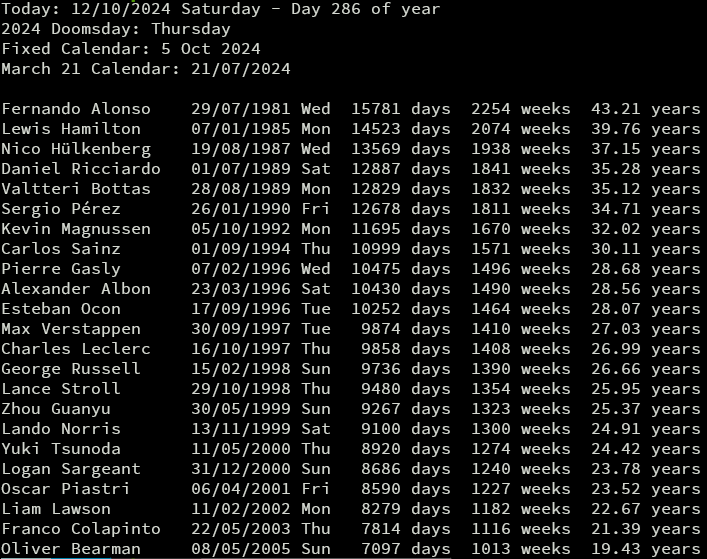

# birthdays

## Getting Started

### Clone the Repository
To clone this repository using Git, run the following command in your terminal:

```bash
git clone https://github.com/opethef10/birthdays.git
```

### Downloading as ZIP
If you're not familiar with Git or prefer not to use it, you can download the repository as a ZIP file. Here’s how:

1. Go to the repository page on GitHub.
2. Click on the green Code button.
3. Select Download ZIP from the dropdown menu.
4. Extract the downloaded ZIP file to your desired location.

## Setup Instructions
- Copy or rename _birthdays.json.example_ to _birthdays.json_ to be able to use your personal data
- Edit _birthdays.json_ file (You can open the file with Notepad) with names and birthdates of your beloved friends with the given format.
- Remember to comply with JSON file format rules. Even if you don't know anything about the JSON format; if you mimic the example file format, you won't have a problem. But pay attention to now have a comma after the last date entry.
- Use **YYYY-MM-DD** iso format while editing. 
- Run `python __main__.py` to print how old your friends are.

## Command Line Arguments
- `python __main__.py -h` for the help text
- `python __main__.py -t` for the information how many days do people have until their 10000th day. 
- `python __main__.py -f [FILE]` for using any other path other than the default path `birthdays.json`. It can be useful if you would like to keep two separate source of birthday information. (Maybe a file called `anniversaries.json` for the anniversary information). Both relative and absolute paths are allowed.
 
## Example Output
Here is an example output from the `birthdays.json.example` file at 12 Oct 2024


